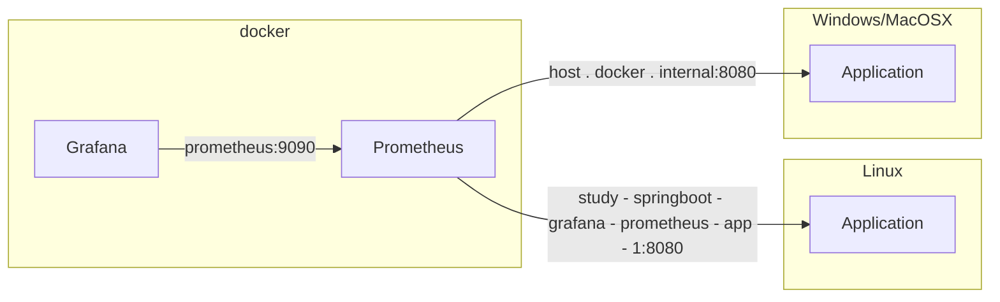

<!--suppress HtmlUnknownAnchorTarget -->
<h1>Study about Spring Boot with Prometheus and Grafana</h1>

<a href="https://kotlinlang.org/" title="Go to kotlin website"></a>
<a href="https://spring.io/" title="Go to spring.io website"></a>
<a href="https://spring.io/projects/spring-boot" title="Go to spring boot page"></a>
<a href="https://maven.apache.org/" title="Go to apache.org website"></a>
<a href="https://www.docker.com/" title="Go to Docker"></a>

<h2 id="table-of-contents">⤴️ Table of Contents</h2>

<ul>
  <li>
    ❓ <a href="#about" title="Go to about bookmark">About</a>
    <ul>
      <li>📊 <a href="#about-diagrams" title="Go to Systems Diagrams bookmark">System Diagrams</a></li>
    </ul>
  </li>
  <li>👩‍🏫 <a href="#learnings" title="Go to learnings bookmark">Learnings</a></li>
  <li>
    🏃 <a href="#how-to-run" title="Go to how to run bookmark">How to Run</a>
    <ul>
      <li><a href="#how-to-run-maven" title="Go to how to run with maven bookmark">Run with Maven</a></li>
      <li><a href="#how-to-run-docker" title="Go to how to run with docker bookmark">Run with Docker</a></li>
    </ul>
  </li>
  <li>
    🚦 <a href="#how-to-test" title="Go to how to test bookmark">How to Test</a>
    <ul>
      <li>
        <a href="#how-to-test-maven" title="Go to how to test maven bookmark">Test with Maven</a>,
        <a href="#how-to-test-docker" title="Go to how to test docker bookmark">Test with Docker</a>
      </li>
    </ul>
  </li>
  <li>📖 <a href="#references" title="Go to about bookmark">References</a></li>
</ul>

<h2 id="about">❓ About</h2>

Studies about Spring Boot with Prometheus and Grafana from the
article <a href="https://medium.com/javarevisited/springboot-app-monitoring-with-grafana-prometheus-7c723f0dec15" title="Go to the link">
Springboot App monitoring with Grafana & Prometheus by Vishnu M V<a/>.

Added some business metrics to Grafana and learned how to provision dashboards and datasources.

<a href="#table-of-contents" title="Go to table of contents">Back to Top</a>

<h2 id="about-diagrams"> 📊 System Diagrams</h2>



<a href="#table-of-contents" title="Go to table of contents">Back to Top</a>

<h2 id="learnings">👩‍🏫 Learnings</h2>

Very easy to enable it with spring boot actuator and there are dashboards ready for use.

Some difficulties getting it to work cross-platform. How docker networking works differently between Windows and Linux.
There is no direct way to access the host IP address from within the container, making prometheus difficult to extract
information from the application by Prometheus scraper.

More investigation would be needed to make the prometheus scraper work correctly on various OS platforms using only one
[target](http://localhost:9090/targets). For now, I have added both URLs to be discarded and accept that one of them
will fail.

<a href="#table-of-contents" title="Go to table of contents">Back to Top</a>

<h2 id="how-to-run">🏃 How to Run</h2>

Pre-requisites:
<ul>
    <li><a href="https://www.oracle.com/java/technologies/downloads/" title="Go to Oracle Java Downloads page">Java 21</a></li>
    <li><a href="https://maven.apache.org/" title="Go to Apache Maven Project website">Apache Maven</a></li>
    <li><a href="https://docs.docker.com/compose/" title="Go to Docker Compose Overview page">Docker & Docker Compose</a></li>
</ul>

Initialize the Prometheus and Grafana with Docker Compose with the command:

```shell
docker compose up
```

| Component  | Url                   | User  | Password |
|------------|-----------------------|-------|----------|
| Prometheus | http://localhost:9090 | -     | -        |
| Grafana    | http://localhost:3000 | admin | admin    | 

<h3 id="how-to-run-maven">Run with Maven</h3>

```shell
mvn spring-boot:run
```

<h3 id="how-to-run-docker">Run with Docker</h3>

Linux/MacOSX:

````shell
docker run --rm \
  -p 8080:8080 \
  -w /app \
  -v ./src:/app/src \
  -v ./pom.xml:/app/pom.xml \
  -v data:/root/.m2 \
  --network=study-springboot-grafana-prometheus_monitoring \
  --name=/study-springboot-grafana-prometheus-app-1 \
  --label com.docker.compose.project=study-springboot-grafana-prometheus \
  maven:3.8.8-eclipse-temurin-21-alpine mvn spring-boot:run
````

Windows (PowerShell):

````shell
$srcPath = (Resolve-Path 'src').Path
$pomPath = (Resolve-Path 'pom.xml').Path

docker run --rm `
  -p 8080:8080 `
  -w /app `
  -v ${srcPath}:/app/src `
  -v ${pomPath}:/app/pom.xml `
  -v data:/root/.m2 `
  --network=study-springboot-grafana-prometheus_monitoring `
  --name=/study-springboot-grafana-prometheus-app-1 `
  --label com.docker.compose.project=study-springboot-grafana-prometheus `
  maven:3.8.8-eclipse-temurin-21-alpine mvn spring-boot:run
````

<a href="#table-of-contents" title="Go to table of contents">Back to Top</a>

<h2 id="how-to-test">How to Test</h2>

Some endpoints to test the business metrics in Grafana.

| Action      | URI                                    | Description                                                                                                     |
|-------------|----------------------------------------|-----------------------------------------------------------------------------------------------------------------|
| Flip a Coin | GET http://localhost:8080/api/flipCoin | Returns head or tail value and register a total count metric and another metric telling how many tails or heads |

And below the Grafana Dashboards

| Dashboard                  | URL                                                                           | Description                          |
|----------------------------|-------------------------------------------------------------------------------|--------------------------------------|
| Business Metrics           | http://localhost:3000/d/d5ae9a0e-e1b5-4e87-8a0a-d0720cc17a88/business-metrics | Metrics added inside the application |
| JVM (Micrometer)           | http://localhost:3000/d/d815b226-48af-4ecd-89de-50782a2d0ada/jvm-micrometer   | Metrics related to the JVM           |
| Spring Boot 3.x Statistics | http://localhost:3000/d/spring_boot_21_2/spring-boot-3-x-statistics           | Metrics related to Spring Boot       |

<a href="#table-of-contents" title="Go to table of contents">Back to Top</a>

<h2 id="references">📖 References</h2>

<ul>
  <li>
    <a href="https://simpleicons.org/" title="Go to simpleicons.org website">Fonts icon</a> used in this documentation.
  </li>
</ul>

<a href="#table-of-contents" title="Go to table of contents">Back to Top</a>