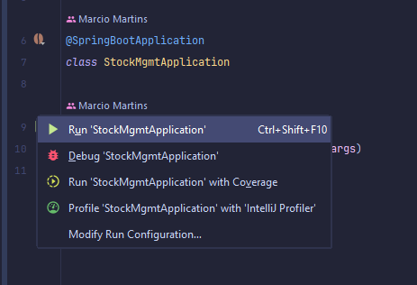
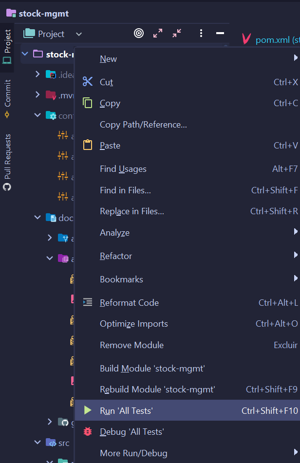

<!--suppress HtmlUnknownAnchorTarget -->


<a href="https://spring.io/" title="Go to spring.io website"></a>
<a href="https://maven.apache.org/" title="Go to apache.org website"></a>
<a href="https://www.docker.com/" title="Go to Docker"></a>
<a href="https://www.mysql.com/" title="Go to Mysql website"></a>
<a href="https://flywaydb.org/" title="Go to Flyway website"></a>

 <a href="https://github.com/users/marciovmartins/projects/2" title="Go to Github Project"></a>

<h2 id="table-of-contents">⤴️ Table of Contents</h2>

<ul>
  <li>❓ <a href="#about" title="Go to about bookmark">About</a></li>
  <li>
    🏃 <a href="#how-to-run" title="Go to how to run bookmark">How to Run</a>
    <ul>
      <li>
        <a href="#how-to-run-intellij" title="Go to how to run intellij bookmark">Intellij</a>,
        <a href="#how-to-run-maven" title="Go to how to run maven bookmark">Maven</a>,
        <a href="#how-to-run-docker" title="Go to how to run docker bookmark">Docker</a>
      </li>
      <li><a href="#how-to-run-disabling-spring-boot-docker-compose" title="Go to how to run/disabling spring-boot-docker-compose bookmark">Disabling spring-boot-docker-compose</a></li>
      <li><a href="#how-to-run-hal-explorer" title="Go to how to run/HAL Explorer bookmark">HAL Explorer</a></li>
    </ul>
  </li>
  <li>
    🚦 <a href="#how-to-run" title="Go to how to test bookmark">How to Test</a>
    <ul>
      <li>
        <a href="#how-to-test-intellij" title="Go to how to test intellij bookmark">Intellij</a>,
        <a href="#how-to-test-maven" title="Go to how to test maven bookmark">Maven</a>,
        <a href="#how-to-test-docker" title="Go to how to test docker bookmark">Docker</a>
      </li>
    </ul>
  </li>
  <li>📝 <a href="#adrs" title="Go to about bookmark">ADRs</a></li>
  <li>🔧 <a href="#tools" title="Go to about bookmark">Tools</a></li>
  <li>📖 <a href="#references" title="Go to about bookmark">References</a></li>
</ul>

<h2 id="about">❓ About</h2>

Component responsible to calculate stock options profitability.

<a href="#table-of-contents" title="Go to table of contents">Back to Top</a>

<h2 id="how-to-run">🏃 How to Run</h2>

The `spring-boot-docker-compose` dependency is used to start up dependencies like the database.

Te docker-compose should be version 2.21 or greater.

<h3 id="how-to-run-intellij">IntelliJ</h3>

Find the main file
at: <a href="src/main/kotlin/dev/martins/marcio/stockmgmt/StockMgmtApplication.kt" title="Go to file StockMgmtApplication.kt">
src/main/kotlin/dev/martins/marcio/stockmgmt/StockMgmtApplication.kt</a>

Execute it clicking on the "play" button and after that in Run.



In case of an error for missing dependencies, reload it with maven command "Reload All Maven Projects":

<a href="#table-of-contents" title="Go to table of contents">Back to Top</a>

<h3 id="how-to-run-maven">Maven</h3>

```shell
mvn spring-boot:run
```

<a href="#table-of-contents" title="Go to table of contents">Back to Top</a>

<h3 id="how-to-run-docker">Docker</h3>

```shell
docker-compose up -d
```

```shell
docker run --rm -v $PWD/src:/src -v $PWD/pom.xml:/pom.xml -v $PWD/docker-compose.yml:/docker-compose.yml -v $PWD/config:/config -v data:/root/.m2 --network=stock-mgmt_main -p 8080:8080 -e "SPRING_PROFILES_ACTIVE=local-docker-db" --name=/stock-mgmt-app-1 --label com.docker.compose.project=stock-mgmt maven:3.8.8-eclipse-temurin-21-alpine mvn spring-boot:run
```

<a href="#table-of-contents" title="Go to table of contents">Back to Top</a>

<h3 id="how-to-run-disabling-spring-boot-docker-compose">Disabling spring-boot-docker-compose</h3>

Disable it in case you want to run the dependencies by your own.

`/config/application.yml`
```yaml
spring:
  docker:
    compose:
      enabled: false
```

<a href="#table-of-contents" title="Go to table of contents">Back to Top</a>

<h3 id="how-to-run-hal-explorer">HAL Explorer</h3>

You can access try and experiment the api using [HAL Explorer](https://github.com/toedter/hal-explorer) via the path:

```
http://localhost:8080/explorer/index.html#uri=http://localhost:8080/
```

<a href="#table-of-contents" title="Go to table of contents">Back to Top</a>

<h2 id="how-to-test">🚦 How to Test</h2>

<h3 id="how-to-test-intellij">Intellij</h3>

To run all the unit and integration tests, right-click on the root folder and select "Run All Tests".



<a href="#table-of-contents" title="Go to table of contents">Back to Top</a>

<h3 id="how-to-test-maven">Maven</h3>

Unit tests:

```shell
mvn test
```

Unit tests + Integration tests:

```shell
docker-compose up -d
```

```shell
mvn verify
```

<a href="#table-of-contents" title="Go to table of contents">Back to Top</a>

<h3 id="how-to-test-docker">Docker</h3>

Unit tests:

```shell
docker run --rm -v $PWD/src:/src -v $PWD/pom.xml:/pom.xml -v $PWD/docker-compose.yml:/docker-compose.yml -v $PWD/config:/config -v data:/root/.m2 --network=stock-mgmt_main -p 8080:8080 -e "SPRING_PROFILES_ACTIVE=local-docker-db" --name=/stock-mgmt-app-1 --label com.docker.compose.project=stock-mgmt maven:3.8.8-eclipse-temurin-21-alpine mvn test
```

Unit tests + Integration tests:

```shell
docker-compose up -d
```

```shell
docker run --rm -v $PWD/src:/src -v $PWD/pom.xml:/pom.xml -v $PWD/docker-compose.yml:/docker-compose.yml -v $PWD/config:/config -v data:/root/.m2 --network=stock-mgmt_main -p 8080:8080 -e "SPRING_PROFILES_ACTIVE=local-docker-db" --name=/stock-mgmt-app-1 --label com.docker.compose.project=stock-mgmt maven:3.8.8-eclipse-temurin-21-alpine mvn verify
```

<a href="#table-of-contents" title="Go to table of contents">Back to Top</a>

<h2 id="adrs">📝 ADRs</h2>

<ul>
  <li>
    <a href="./docs/adr/001/define-architecture-for-the-share-profitability-feature.md" title="Go to ADR-001">
      ADR-001: Define architecture for the share profitability feature
    </a>
  </li>
</ul>

<a href="#table-of-contents" title="Go to table of contents">Back to Top</a>

<h2 id="tools">🔧 Tools</h2>

Check the <a href="./docs/HELP.md" title="Go to HELP.md file">HELP.md</a> file with a list of links and articles about the
tools used
in this project.

<a href="#table-of-contents" title="Go to table of contents">Back to Top</a>

<h2 id="references">📖 References</h2>

<ul>
  <li>
    <a href="https://simpleicons.org/" title="Go to simpleicons.org website">Fonts icon</a>
  </li>
  <li>
    Banner created by <a href="https://github.com/jtonynet" title="Go to Jtony's github">Jtony</a>
    with <a href="https://www.bing.com/images/create/um-touro-marron-antropomorfico-parecido-com-o-pers/1-656cdd23613546c1a14366b64e37cc23?FORM=GENCRE" title="Go to Bing AI used in the banner">
    Bing AI</a>
    and <a href="https://www.gimp.org/" title="Go to GIMP website">GIMP</a>    
  </li>
</ul>

<a href="#table-of-contents" title="Go to table of contents">Back to Top</a>