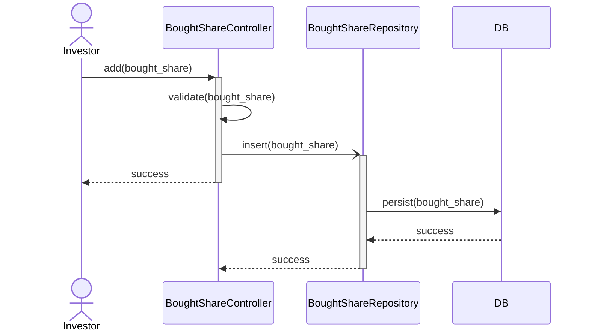
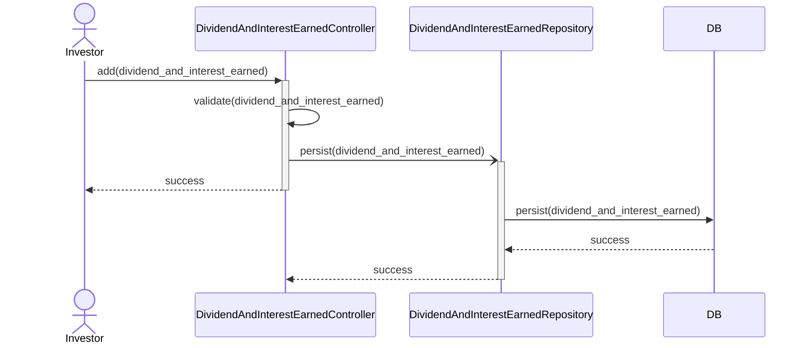
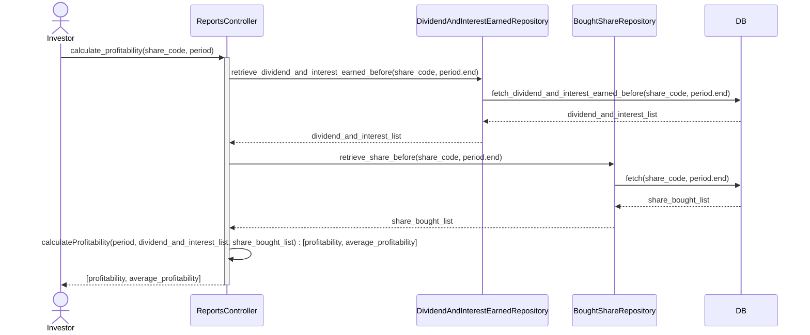
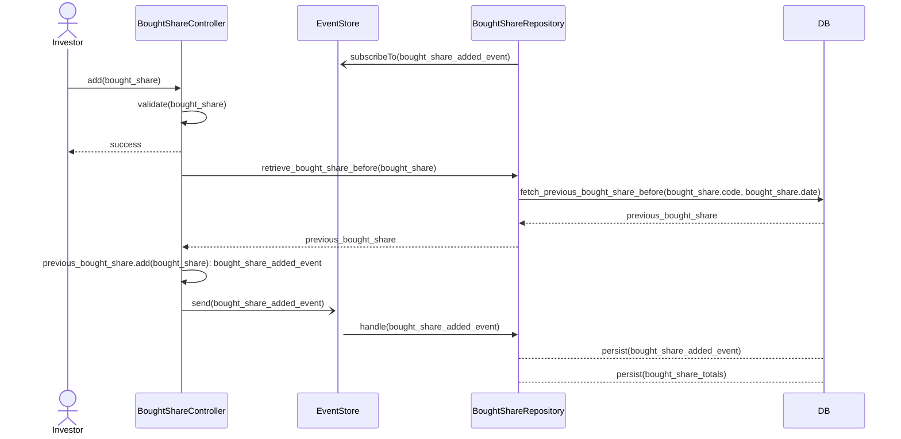
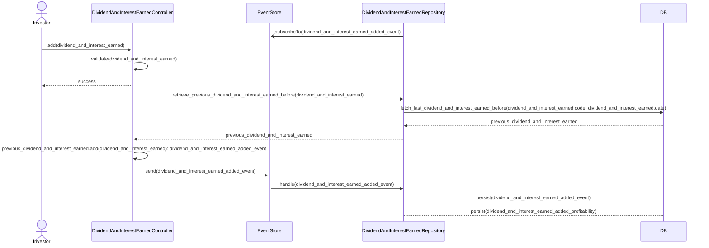
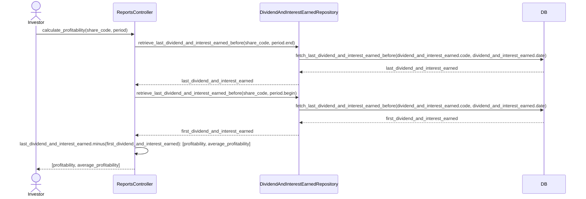

# 001: Define Architecture For the Share Profitability Feature

Date: 2023-12-03

Status: Accepted

## Table of Contents

- 🖼️ [Context](#-context)
    - [Option 1: Real-time calculation](#option-1-real-time-calculation)
    - [Option 2: Event Sourcing](#option-2-event-sourcing)
        - [Option 2.1: Relational Database](#option-21-relational-database)
        - [Option 2.2: Event-Driven Architecture](#option-22-event-driven-architecture)
            - [Option 2.2.1: Pub/Sub](#option-221-pubsub)
            - [Option 2.2.2: Event Streaming](#option-222-event-streaming)
- 🎯 [Decisions](#-decisions)
- 🥅 [Consequences](#-consequences)

## 🖼️ Context

Stock profitability is information that is based on the sum of all previous stock profits and purchased shares.

It must be possible to recover profitability over different period intervals.

Performance should not degrade significantly over time as the number of entries increases.

Information about interest earned and shares purchased is immutable.

Dividends and interest earned use the total paid for shares to calculate profitability. To do this, you must use the
last share purchased before the dividend and interest date.

For example, shares purchased:

| Share Code | Date        | Share Price | Qty | Paid    | Total Qty | Total Paid | 
|------------|-------------|-------------|-----|---------|-----------|------------|
| RECT11     | 2023-10-23  | 43.08       | 40  | 1723.20 | 213       | 13599.50   |
| RECT11     | 2023-10-20  | 43.16       | 2   | 86.32   | 173       | 11876.30   |
| RECT11     | 2023-09-01* | 49.09       | 41  | 2012.69 | 171       | 11789.98   |
| ...        |
| RECT11     | 2020-08-20  | 97.25       | 16  | 1556.00 | 16        | 1556.00    |

Upcoming dividends and interest earned:

| Share code | Date       | Amount Earned (R$) | Total Amount Earned (R$) | Profitability (%) | Average Profitability (%) |
|------------|------------|--------------------|--------------------------|-------------------|---------------------------|
| RECT11     | 2023-10-16 | 70.00              | 1670.20                  | 0.593724501653099 | 0.572161914607075         |
| RECT11     | 2023-09-15 | 70.00              | 1600.20                  | 0.593724501653099 | 0.550599327561052         |
| ...        |
| RECT11     | 2020-09-15 | 11.52              | 11.52                    | 0.740359897172237 | 0.740359897172237         |

### Profitability Calculation

```
Profitability = ( "Single Amount Earned" * 100 ) / "Total Paid for the Bought Share"

Profitability = ( 70.00 * 100 ) / 11789.98                           # dividends earned at 2023-10-16 and bought share state at 2023-09-01*
Profitability = ( 7000.00 ) / 11789.98
Profitability = 0.593724501653099
```

### Average Profitability Calculation

The method used is the ["running average" or "moving average"](https://en.wikipedia.org/wiki/Moving_average).

```
Average Profitability = ("Profitability (%)" + "Last Average Profitability (%)") / 2

Profitability = ( 0.593724501653099 + 0.550599327561052 ) / 2        # dividends earned at 2023-10-16 and bought share state at 2023-09-01
Profitability = ( 1.14432382921415 ) / 2
Profitability = 0.572161914607075
```

### Option 1: Real-time calculation

Only the `share code`, `date`, `share price`, `quantity` and `paid amount` will be persisted for the purchased share.

Only the `share code`, `date` and `earned amount` will be kept for dividends and interest earned.

To calculate the `profitability (%)` it will be necessary to add up the entire amount paid for the share.

To calculate the `average profitability (%)` it will be necessary to calculate the profitability of each dividend and
previous interest earned.

Add new purchased share:



Add new Dividend and Interest Earned:



Calculate Profitability for Period:



Pros:

- Any changes to the calculation formula can be easily reflected in all previous lines at any time. No data migration.
- Any new line added in the past will be immediately considered in the calculations. No data migration.
- Minimum data stored in the database.
- Easy to implement and test. Small complexity.

Cons:

- The only way to know the profitability, average profitability, total amount earned, total quantity and total paid is
  by calculating the API resources.
- Calculation time will degrade over time as the number of rows increase. The big-o notation for CPU is O(p) and for
  database it is O(n + p).
- The Share concept will be divided into two tables: `bought_share` and `dividends_and_interest_earned`.

### Option 2: Event Sourcing

> Instead of storing just the current state of the data in a domain, use an append-only store to record the full series
> of actions taken on that data. The store acts as the system of record and can be used to materialize the domain
> objects. This can simplify tasks in complex domains, by avoiding the need to synchronize the data model and the
> business domain, while improving performance, scalability, and responsiveness. It can also provide consistency for
> transactional data, and maintain full audit trails and history that can enable compensating actions.


Links:

- https://learn.microsoft.com/en-us/azure/architecture/patterns/event-sourcing
- https://martinfowler.com/eaaDev/EventSourcing.html

#### Option 2.1: Relational Database

Besides the minimum properties for the bought share table (see previous option description), the `total paid`
and `total quantity` from the shares table would be calculated and persisted.

```
Total paid = "total paid from the last row" + "amount paid"
```

```
Total quantity = "total quantity from the last row" + "amount paid"
```

Same for `profitability`, and `average profitability` from the dividends and interest earned table.

For every new insertion, only the last row from both tables would be required to do the calculation.

The data should be split in two tables for `bought share`:

- bought_share_events: should be immutable.
- bought_share_totals: it is an 1:1 relationship with `bought_share_events` table and the rows can be deleted or updated
  in case of recalculation. The primary key could be the `bought_share_events.bought_share_id`.

Similar to `dividends and interest earned`:

- dividends_and_interest_events: should be immutable.
- dividends_and_interest_profitability: it is an 1:1 relationship with `dividends_and_interest_events` table and the
  rows can be deleted or updated in case of recalculation. The primary key could be
  the `dividends_and_interest_events.dividends_and_interest_id`.

When a new `bougth share added event`  is added, all the profitability rows after the `bought_share_events.date` must be
recalculated for both `bought_share_events` and `dividends_and_interest_profitability` tables.

When a new `dividends and interest earned` is added, all the profitability rows after the `dividends_and_interest.date`
must be recalculated for `dividends_and_interest_profitability` table.

Add new Bought Share:



Add new Dividend and Interest Earned:



Calculate Profitability for Period:



The repository needs to replay the events til the desired state. To help this process a snapshot can be created after
some events been added.

Pros:

- Less computational calculation when querying the data. The calculation logic will be at the insertion.
- Possibility to look in the database rows and know the `total paid` and `total quantity` from bought shares table and
  the `profitability`, `average profitability` and `total amount earned` from the dividends and interests earned table.
- The query will be stable and fast and the insertion will not degrade over time. The big-o notation for the CPU and
  database is O(1).
- Immutable data for the `add bought share action` and the `add dividends and interest earned action`.
- Small to average effort to implement and test.
- No external dependency.

Cons:

- Required to implement an error handling when persisting the event into the database, otherwise the event would be
  lost.
- Required to implement a snapshot strategy to avoid query all the entity rows to build some entity state.
- Scalability limited to the number of threads.
- A feature to recalculate profitability is required for the use case when a new bought share need to be inserted before
  the last row. This could happen because infrastructure problems, processing the bought share in an unordered order,
  the information arrives later and so on. The order to calculate profitability is based on the `bought share date`.

#### Option 2.2: Event-Driven Architecture

The Event-driven architecture is an architecture pattern where an event publisher sends an event to an event channel and
an event consumer receive and reacts on that.

> An event is a state change or an update within the system that triggers the action of other systems. It can be
> anything from a transaction and sensor input to a mouse click and a photo upload, etc. Events may vary in complexity
> and size and originate from both internal and external sources.

> A notification is a message created by one component to inform about the occurrence of an event and describe it to
> other components. Notifications contain information about events and the context of their occurrences such as location
> or time.

> An event driven architecture can use a publishing/subscribe (also called pub/sub) model or an event stream model.
>
> - Pub/sub: The messaging infrastructure keeps track of subscriptions. When an event is published, it sends the event
    to each subscriber. After an event is received, it can't be replayed, and new subscribers don't see the event.
> - Event streaming: Events are written to a log. Events are strictly ordered (within a partition) and durable. Clients
    don't subscribe to the stream, instead a client can read from any part of the stream. The client is responsible
    for advancing its position in the stream. That means a client can join at any time, and can replay events.

Pros:

- Enables minimal coupling.
- Promotes fault tolerance.
- Simplifies horizontal scalability.
- Auditing is made easier.
- Reduced technical debt. Even when operating in the same application, EDA allows individual services to operate and
  update independently. This reduces inter-service dependencies and technical debt between releases.

Cons:

- Increase complexity?
- Problems with schema changes over time?
- Eventual Consistency.
- Duplicated events. Without appropriate planning and alignment, a single event may trigger multiple duplicate messages
  across different services, creating gaps in communication.
- Lack of clear workflow order. Each step along a workflow is triggered when a service or broker is alerted to a
  particular event. If the receiving component isn't properly calibrated to respond to the event, it will create errors
  and cause cascading workflow issues.
- Error handling and troubleshooting. A typical web-scale application can easily include hundreds of message brokers and
  services, all which will need to constantly pass and receive events. Event-driven architecture requires a
  comprehensive set of monitoring tools and practices that provides visibility into the event flow.
- The clients are not really decoupled, since only this service can consume the messages.

Links:

- https://www.altexsoft.com/blog/event-driven-architecture-pub-sub/
- https://www.redhat.com/en/topics/integration/what-is-event-driven-architecture
- https://en.wikipedia.org/wiki/Event-driven_architecture
- https://learn.microsoft.com/en-us/azure/architecture/guide/architecture-styles/event-driven
- https://martinfowler.com/articles/201701-event-driven.html
- https://www.techtarget.com/searchapparchitecture/tip/Event-driven-architecture-pros-and-cons-Is-EDA-worth-it
- https://www.confluent.io/blog/journey-to-event-driven-part-1-why-event-first-thinking-changes-everything/

##### Option 2.2.1: Pub/Sub

> Publish/subscribe systems follow the typical event-driven structure, yet with slightly different names of the
> components. From the pub/sub perspective, the producers of event notifications act as publishers and the consumers as
> corresponding subscribers, hence the name. But the idea of interaction between systems remains unchanged.

![Image of Event-Drive Architecture Components diagram as the title, three producers boxes on the left (producers 1, 2 and 3), in the middle an Event manager box representing different brokers (e.g. Kafka cluster) and three consumers boxes on the right (consumer 1 subscribed to A, consumer 2 subscribed to A + B and consumer 3 subscribed to B + C. The Producer 1 is sending an Event A to the event manager and which is sending it to consumers 1 and 2. The Producer 2 is sending an Event B to the Event manager which is sending it to consumers 2 and 3. The Producer 3 is sending an Event C to the event manager which is sending it to Consumer 3. Image by altexsoft.](event-driven-architecture-components.webp)

Using a pub/sub makes possible to split this bounded context in smaller microservices. We will create two microservices,
and they will also emit events:

- BoughtShareService
    - BoughtShareAddedEvent
- DividendAndInterestEarnedService
    - DividendAndInterestEarnedEvent

The `DividendAndInterestEarnedService` will subscribe to the `BoughtShareAddedEvent` and keep locally the information
about total amount paid for the bought share, which is required to calculate the profitability.

TODO: create some component diagram.

Possible Tools:

- RabbitMQ: Lightweight service and possibility to configure the exchange to be a `topic` or `fanout` and work as a
  pub/sub.
- Redis: Lightweight service. Needs more research but according to the documentation, it works as a pub/sub using
  channels.

Similar to the [Relational Database](#option-21-relational-database) approach. The difference is that the Event Store is
an external service.

The responsibility to implement the event sourcing is still on the microservice side.

Pros:

- The event broker is responsible to handle the redelivery in case of errors.
- DQL for fatal errors.
- Possible to scale horizontally each microservice individually.
- The clients are really decoupled from each other.

Cons:

- Increase in the eventual consistency latency time with the increase of the latency when sending the event in the
  network and receive the message later by the subscribed service.

Reference links:

- https://www.altexsoft.com/blog/event-driven-architecture-pub-sub/

##### Option 2.2.2: Event Streaming

With event streaming, the EventStore is responsible to log all the events sent and become the source of truth. The
events are persisted as long as the information is needed by the organisation.

Possible tools:

- Apache Kafka: Heavyweight service with several other functionalities besides the pub/sub.

Pros:

- This makes the microservices more lightweight. The source of truth for the aggregates will be EventStore.
- Possibility to add a new subscriber and replay all the events from the beginning.
- Use already existing event storming patterns instead to implement it inside the microservices.

Cons:

- Required specialised professionals to setup and maintain the EventStore (e.g.: Kafka)

## 🎯 Decisions

We will implement all the options for learning purpose and incrementally except the "Option 2.1: Relational Database"
because there is little chance to get a project where there is a restriction or need to do not have external dependency.

We will follow the options order and simulate the evolution of the business and incrementally moving from a monolith
architecture to a microservice architecture.

## 🥅 Consequences

Should be available, after the implementation, an api resource to get the profitability reports in JSON. It will be
possible for the stakeholders to make analysis manually.

Feature to retrieve the bought shares and dividends and interest will be implemented in the future if needed.

The recalculation of the dividends and interest earned will be implemented later in the future and should be handled
manually for now.